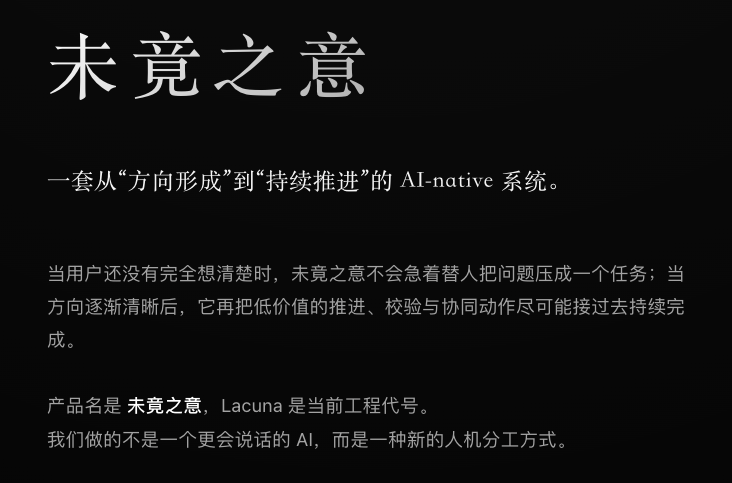

# 未竟之意 / Lacuna

未竟之意不是一个更会替人下定义的 AI 聊天产品。

它在尝试回答另一个越来越贵的问题：当人还没完全想清楚时，系统能不能不要急着把问题压成一个任务；当方向逐渐清楚后，系统能不能把后续推进真正接过去，而不是还要人自己一直盯着。

产品名是 **未竟之意**，**Lacuna** 是当前工程代号。

## 第一阶段先服务谁

未竟之意第一阶段先服务创业者、小团队负责人和早期项目 owner。

因为他们最容易同时遇到两个问题：
- 方向形成时，容易被 AI 或传统工具过早压缩
- 方向逐渐清楚后，后续推进又仍然需要自己持续盯住

也正因为这两种痛点同时存在，他们既会最先愿意用起来，也最可能最先为它付费。

## 这个仓库是什么

这是一个对外公开的产品仓，不是完整开发源，也不是尽调包。

这里主要放的是：
- 产品层表达
- 当前阶段状态
- 精简后的市场切口与扩张路径
- 几个最能说明方向的场景
- 精选视觉材料

这里不会放：
- 完整源码
- 内部 specs / records / prompt / rule / eval 链
- 历史思考资产与判断链
- 能直接反推出核心方法论和实现路径的细节

## 当前状态

项目目前处于超早期验证阶段，但已经不是一句空口号。

已经形成的部分包括：
- 清晰的产品命题与竞争边界
- 从“方向形成”到“持续推进”的连续结构
- 当前阶段先切入的人群、场景和市场路径
- 可对外展示的视觉表达与下一层私下材料框架

精选视觉材料：
- [公开页 PDF 一页纸](./assets/poster/weijingzhiyi-lacuna-one-pager.pdf)

更完整的阶段信息见：
- [`STATUS.md`](./STATUS.md)
- [`MARKET_LOOP.md`](./MARKET_LOOP.md)
- [`SCENARIOS.md`](./SCENARIOS.md)
- [`REPO_SCOPE.md`](./REPO_SCOPE.md)

## 建议阅读顺序

1. [`index.html`](./index.html)
2. [`STATUS.md`](./STATUS.md)
3. [`MARKET_LOOP.md`](./MARKET_LOOP.md)
4. [`SCENARIOS.md`](./SCENARIOS.md)
5. [`REPO_SCOPE.md`](./REPO_SCOPE.md)

## 联系方式

如果你是：
- 对人机协作新结构有判断的投资人
- 在高价值连续任务里有真实场景的小团队负责人或项目 owner
- 愿意一起把早期产品形态打磨得更锋利的设计伙伴

可以联系我继续往下聊：
- Email：`1061790014@qq.com`
- WeChat：`Jyl2012111`
- GitHub：<https://github.com/jyl201210-lab>

## 说明

这个仓库默认不是开源产品本体，而是一个公开产品入口。
未竟之意仍在继续生长；更深的 demo、实现路径与判断材料，只会在下一层沟通里展开。
